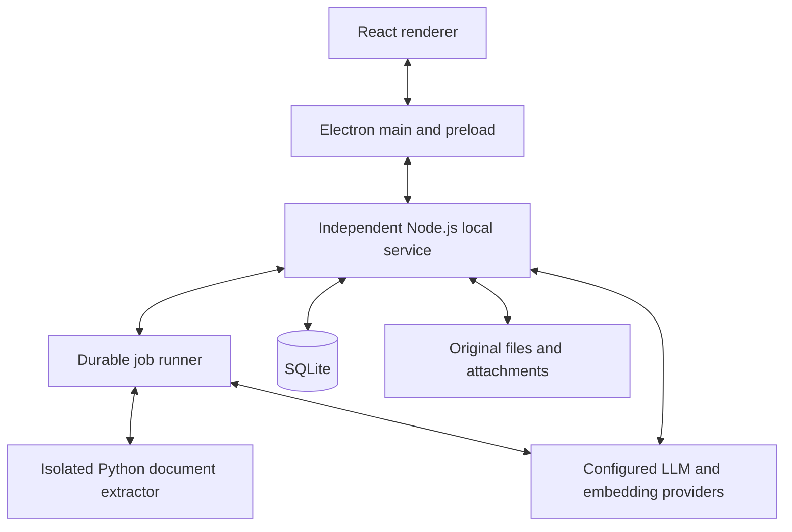

# knoter Desktop Rewrite: Implementation Brief

- Prepared: 2026-09-16
- Language: English
- Status: Rewrite plan; frontend-only prototype is the current implementation scope.

## 1. Assignment and scope

Build a local-first personal knowledge application for macOS and Windows, with
four complete workflows:

1. Import or watch Markdown/PDF sources and use an LLM to create and update a wiki.
2. Answer questions from that wiki with inspectable citations.
3. Provide a polished wiki reader and manual editor with reliable persistence.
4. Maintain structured documents such as tasks and calendar events through both
   background processing and manual interaction.

This brief records the user's requested rewrite plan. The current task builds
a frontend-only prototype with a replaceable mock API. Automated tests and CI
are deferred by explicit user instruction on 2026-09-16; use type checking,
production builds, and manual walkthroughs for now. When assigned to implement
the rewrite, work through the
milestones below; do not interpret this document as authorization to deploy,
publish, purchase services, delete the legacy application, or migrate user data
in place.

Read `agents.md`, `cli/agents.md`, `web/agents.md`, `docs/architecture.md`, and
`docs/testing.md` first. Those documents describe the legacy implementation.
The architectural changes below are scoped to the new application, not to
maintenance of the legacy packages. Add a scoped guide for the rewrite when
creating its directory so future agents do not apply conflicting legacy runtime
rules to new code. Repository-wide Git and user-data preservation rules remain.

### Intentional changes from the legacy architecture

| Legacy | Rewrite default | Reason |
| --- | --- | --- |
| CLI commands coordinate most operations | A persistent local service owns operations | UI, jobs, and chat need the same durable state and live events |
| External coding agent edits files | Service calls an LLM through a provider adapter and applies validated changes | Predictable writes, retries, and conflict handling |
| Markdown files are the generated document store | SQLite is authoritative for application documents | Atomic document, revision, citation, and task-state updates |
| One principal `llm-wiki.md` | Multiple linked wiki documents with stable IDs | Focused retrieval and incremental updates |
| Agent maintains Markdown and HTML together | Application renders trusted components from document data | Consistent appearance and real editing/interaction |
| macOS launchd integration only | Explicit macOS and Windows background-host adapters | Background behavior must work in installed builds on both OSes |

Reuse source files, useful workflow rules, and manual examples. Review legacy
algorithms before reusing small helpers; do not copy old orchestration, HTML
generation, database migrations, or UI state wholesale.

Initial exclusions: multi-user collaboration, cloud synchronization, browser-only
hosting, a general plugin marketplace, external calendar synchronization, and
arbitrary agent-generated executable UI. A CLI can later become a thin client
of the local service.

## 2. Runtime architecture



- **Renderer:** views, editor state, and user interaction. No filesystem,
  database, shell, or provider credentials. Use a narrow preload API.
- **Electron main:** windows, dialogs, menus, notifications, native integration,
  and the authenticated connection to the service. No duplicate document logic.
- **Local service:** single authority for document writes, migrations, source
  metadata, revisions, jobs, retrieval, and conversation persistence.
- **Job runner:** an internal service module, initially one ingestion job at a
  time per workspace. LLM calls are asynchronous; CPU-heavy extraction runs in
  a child process. Chat must remain usable during ingestion.
- **Extractor:** receives a source reference and returns a versioned extraction
  result. It never edits application documents or opens the application DB.

Use versioned JSON request/response/event contracts over local IPC: a Unix-domain
socket on macOS and a named pipe on Windows. Electron main forwards a typed API
to the renderer. Include request IDs, cancellation, protocol version negotiation,
message-size limits, and current-user endpoint access. Use an authenticated
handshake; do not treat knowledge of a pipe name as authorization. Reconnect by
fetching authoritative state and replaying durable events after a cursor.
Transient token events can be replaced by the saved partial conversation state.

There is no public HTTP server in the first release. Provider integrations use
outbound requests. Browser development can use a fixture adapter behind the same
renderer contract; installed-app acceptance must use the real service.

### Background lifecycle contract

The service is independent of the Electron process. A utility process owned by
Electron alone does not satisfy continued operation after the desktop app exits.
Ship the service with a pinned Node runtime; never depend on a user's Node, Bun,
Python, shell startup files, or `PATH`.

- Closing a document window leaves configured background processing active.
- Exiting the desktop UI leaves the independent service active when background
  processing is enabled. Provide an explicit control to stop background work.
- Enable/disable, status, start, stop, and restart are explicit service actions.
- Run in the logged-in user's session. Work while logged out, asleep, or powered
  off is not promised. Resume scans and expired job leases after login/wake.
- A service singleton and job leases prevent two desktop launches or an OS
  restart from processing the same job simultaneously.
- Credentials unavailable because of OS state produce a recoverable waiting
  state rather than a retry storm or a plaintext fallback.

## 3. macOS and Windows requirements

### Target matrix

Initial release architectures: **macOS arm64, macOS x64, Windows x64**.
Windows arm64 is a later target unless its complete dependency chain passes the
same packaged tests. Do not claim support based on Electron support alone.

Windows 11 is the initial Windows OS target. In M0, record the exact supported
macOS releases and minimum version from the selected Electron, Node, Python,
and extractor dependencies. The proposed macOS registration API requires macOS
13 or later; the actual application floor may be higher. Windows 10 compatibility
is not implied and must be tested separately if added.

| Concern | macOS implementation | Windows implementation |
| --- | --- | --- |
| Background host | Bundled per-user LaunchAgent, registered through `SMAppService` | Per-user Task Scheduler task with a logon trigger and explicit restart settings |
| Native bridge | Small signed helper for ServiceManagement and Keychain access | Small helper for Task Scheduler and current-user DPAPI access |
| Local IPC | Unix-domain socket with owner-only permissions | Named pipe restricted to the current user, plus authenticated handshake |
| Data root | OS application-support location | Local application-data location, not roaming data |
| Credentials | Keychain item accessible to the signed service/helper identity | Current-user DPAPI-encrypted credential blob with user-only file access |
| First distribution | Signed/notarized `.app` in DMG; ZIP for updater tooling | Signed per-user Squirrel `Setup.exe` and update artifacts |
| Native binaries | Build/test separately for arm64 and x64 | Build/test for x64 and selected Node ABI |
| Verification | Manual clean installed-app walkthrough | Manual clean installed-app walkthrough |

Apple's current API can register bundled LaunchAgents and expose their approval
status; avoid copying the legacy loose-plist installer into the new app.
[Apple SMAppService](https://developer.apple.com/documentation/servicemanagement/smappservice)

For Windows, explicitly configure the task's user, non-elevated execution,
restart-on-failure, instance policy, battery behavior, and execution time limit.
The default task duration must not terminate an intended persistent service.
Use a launcher that remains attached to the service process so the scheduler can
observe failures. Keep launch paths valid across application updates.
[Microsoft logon triggers](https://learn.microsoft.com/en-us/windows/win32/taskschd/taskschedulerschema-logontrigger-triggergroup-element),
[Microsoft task settings](https://learn.microsoft.com/en-us/windows/win32/taskschd/tasksettings)

Implement a small `platform` boundary for background registration, paths,
credentials, and native shell behavior. Avoid OS checks throughout domain code.
The Node service must retrieve credentials with the UI absent; merely storing
them through an Electron-main-only API is insufficient.
[Apple Keychain](https://developer.apple.com/documentation/security/adding-a-password-to-the-keychain),
[Microsoft DPAPI](https://learn.microsoft.com/en-us/windows/win32/api/dpapi/nf-dpapi-cryptprotectdata)

### Filesystem and UI differences

- Use OS path APIs and explicit executable argument arrays. Do not construct
  shell commands from filenames. Account for spaces, Korean filenames, Unicode
  normalization, case-only renames, Windows reserved names, and long paths.
- Store object IDs independently of filenames. Keep original display names and
  source-path mappings; use generated names for managed storage.
- Treat filesystem events as hints. Combine debounce/content hashes with startup,
  wake, and periodic reconciliation scans. Handle atomic-save rename patterns,
  partial copies, locked files, unavailable folders, and cloud placeholder files.
- A watched folder losing access is not evidence that its files were deleted.
  Keep its indexed sources and report the unavailable location.
- Test access from the actual background helper, including macOS file access
  restrictions and Windows protected folders. The picker process and worker
  process may have different access behavior.
- Use Command shortcuts on macOS and Control on Windows, native menu conventions,
  visible keyboard focus, IME composition, and Windows display scaling.
- Keep the live DB in managed local storage. Do not support directly sharing a
  running SQLite/WAL database through a network drive or cloud-sync folder.

### Packaging, updates, and recovery

Use Electron Forge for desktop packaging, makers, and signing integration.
Forge does not automatically solve independent service/extractor packaging.
Bundle their runtimes and native modules explicitly, outside ASAR where required.
Build the service's native modules for the bundled **Node** ABI; only modules
actually loaded in Electron require the Electron ABI.
[Forge build lifecycle](https://www.electronforge.io/core-concepts/build-lifecycle)

Produce artifacts on the corresponding OS. Include source/runtime/model license
notices and checksums. Development builds may be unsigned; public distribution
requires the release signing setup. macOS signing/notarization includes embedded
helpers and libraries. Windows signing does not guarantee immediate SmartScreen
reputation. Signing credentials and an update hosting location are release
inputs, not prerequisites for implementing the application.
[macOS signing](https://www.electronforge.io/guides/code-signing/code-signing-macos),
[Windows signing](https://www.electronforge.io/guides/code-signing/code-signing-windows),
[Squirrel maker](https://www.electronforge.io/config/makers/squirrel.windows)

Before an update: stop accepting new jobs, checkpoint/cancel active work, suspend
OS restarts, stop the service and extractor, and take a consistent backup. Replace
versioned binaries, update the background registration, migrate under an exclusive
service startup lock, and restart. On Windows, account for executable/DLL file
locks and installer startup events. Do not run an older binary against a newer
incompatible schema. A failed migration must preserve a restorable pre-update
database and original files.

Automatic updating needs both client integration and a hosted update feed; select
the feed when a release destination is assigned. Test one real upgrade before
claiming updater support. Uninstall removes background registration and executable
resources; user data is retained unless the user explicitly requests deletion.
[Forge auto update](https://www.electronforge.io/advanced/auto-update)

## 4. Library decisions and tradeoffs

These are implementation defaults, not claims of already-tested compatibility.
Pin compatible versions and commit lockfiles in M0. Choose supported stable
releases; do not blindly install latest prereleases. Keep legacy package managers
unchanged; use an isolated npm workspace for the TypeScript rewrite.

| Library/tool | Why use it here | Cost or acceptance gate |
| --- | --- | --- |
| Electron | Consistent Chromium rendering and native desktop integration across both OSes | Larger install/memory footprint; package and update the embedded runtime |
| React + TypeScript | Shared typed contracts, composable document views, and ecosystem integration | Runtime validation is still required at IPC and LLM boundaries |
| Vite | Focused renderer development/build tooling | Keep Node/native imports out of the renderer build |
| Tailwind CSS | Shared spacing, typography, colors, and state styles | Define semantic tokens; avoid arbitrary classes becoming a second design system |
| shadcn/ui | Accessible composable components whose code can be customized for the workbench | It distributes component source, not a finished design; maintain imported code and inspect upstream updates |
| Milkdown | Markdown-oriented editing built on ProseMirror/Remark | Validate tables, math, links, citations, IME input, undo, and import/export fidelity before adoption |
| Node.js | Common TypeScript service runtime and broad SDK/native module support | Bundle its runtime separately from Electron; pin versions and ABI |
| SQLite + better-sqlite3 | Transactions, relational integrity, FTS5, and a small local deployment | One service owns writes; keep synchronous queries short and test native packaging |
| sqlite-vec | Vector search in the same local SQLite deployment without a separate vector server | Provisional: native loading, release stability, and real-corpus latency must pass M0/M4 |
| AI SDK | Common generation, streaming, structured output, and tool-call integration | Provider capabilities differ; keep SDK types behind an internal adapter |
| Docling | PDF layout/table/OCR extraction and a structured intermediate document | Provisional: Python/model footprint and paper extraction quality must pass a packaged CPU-only spike |
| PDF.js | In-app original PDF rendering and navigation to cited pages | Viewing is distinct from high-quality paper extraction; do not assume it solves OCR |
| Electron Forge | Packaging, platform installers, signing hooks, and publishing integration | Separate native helpers, service lifecycle, and update feeds still need explicit work |

Keep the editor integration behind a small component boundary. If Milkdown fails
the defined document round-trip fixture, record the failing capability before
choosing another editor. Do not silently reduce the supported document format.

Docling's documented OS support is not proof that the packaged application works.
The app must manage a pinned extraction runtime and verified model files without
requiring a user to run pip or install Python. Prefetch required models or provide
an app-managed first-use download with progress/retry. First-run offline behavior
must be explicit. CPU execution is the baseline; GPU acceleration is optional.
[Docling installation](https://docling-project.github.io/docling/getting_started/installation/),
[Docling model management](https://docling-project.github.io/docling/usage/advanced_options/)

Other decision references:
[Electron](https://www.electronjs.org/docs/latest),
[React](https://react.dev/learn),
[TypeScript](https://www.typescriptlang.org/docs/),
[Vite](https://vite.dev/guide/),
[Tailwind with Vite](https://tailwindcss.com/docs/installation/using-vite),
[shadcn/ui](https://ui.shadcn.com/docs),
[Milkdown](https://milkdown.dev/docs/guide/why-milkdown),
[better-sqlite3](https://github.com/WiseLibs/better-sqlite3),
[sqlite-vec Node bindings](https://alexgarcia.xyz/sqlite-vec/js.html),
[AI SDK](https://ai-sdk.dev/docs/ai-sdk-core/overview),
[PDF.js](https://mozilla.github.io/pdf.js/getting_started/).

## 5. Storage and format contracts

### Authority and portability

Application documents, tasks, events, revisions, conversations, and jobs are
authoritative in SQLite. Original input bytes and attachments are authoritative
in a managed content-addressed file store. Extraction results and search indexes
are rebuildable projections, with extractor/model versions recorded.

Database-first storage intentionally makes external Markdown editing an import
operation, not automatic two-way wiki synchronization. Implement explicit export
and backup from the beginning. A Markdown export alone is not a full backup.

Use SQLite's backup API or a quiesced checkpointed snapshot, not an arbitrary copy
of an open database file. Coordinate the snapshot with immutable blob references
and retention so every referenced original exists in the backup. Stage new blobs
before committing their DB references; clean abandoned staging files on recovery.

| Format | Use and rationale | Required behavior |
| --- | --- | --- |
| Original PDF/MD bytes | Preserve evidence and allow re-extraction | Retain immutable source versions; never modify the watched original |
| Markdown text | Canonical wiki body stored in SQLite; portable text editing/export | Define CommonMark/GFM subset plus explicit math/citation support; raw HTML is disabled |
| YAML frontmatter | Human-readable metadata on Markdown import/export | IDs, kind, title, source references, and export schema version; not a second metadata authority |
| Typed relational rows | Task state, dates, event ranges, links | Validate types/constraints; query exact fields instead of parsing prose |
| Versioned JSON | IPC, LLM change sets, extraction results, and portable structured exports | Validate at boundaries; reject unknown operations and incompatible schemas |
| SQLite database | Atomic application state and migrations | Foreign keys, short transactions, schema versioning, consistent backup |
| Embedding float vectors | Derived semantic retrieval data | Record model, dimension, and content version; never mix embedding spaces |
| iCalendar `.ics` | Calendar export to interoperable tools | Stable UID, correct time zone/all-day semantics; export does not imply live sync |
| Backup manifest + DB snapshot + blobs | Complete recovery and migration between machines | Versioned manifest, content checksums, restore validation; exclude machine-bound credentials |

Normalize imported line endings in the derived text representation while keeping
original bytes unchanged. Do not use OS paths as document IDs. Use generated
UUIDs for entities and SHA-256 for immutable blob identity; a matching blob alone
does not erase distinct source records or provenance.

Store audit timestamps as UTC instants. Keep calendar time zone IDs and intended
local times where relevant. Date-only deadlines and all-day events must stay
date-only; do not coerce them to midnight UTC. Calendar end dates are exclusive
where required by the export format. Recurrence can follow after simple events,
but exported UIDs must already remain stable.
[iCalendar RFC 5545](https://www.rfc-editor.org/rfc/rfc5545)

### Minimum entity model

- `sources`, `source_versions`: original location, media type, blob reference,
  content hash, availability, import policy, and extraction status.
- `source_segments`: source version, ordered text/table content, page and region
  when available, and extraction warnings. Preserve the extractor's structured
  output separately so a Markdown projection does not discard layout evidence.
- `documents`: ID, kind, title, Markdown body, revision, and protection policy.
  `task_fields` and `event_fields` extend document IDs with typed domain fields.
- `document_revisions`, `change_sets`: prior/current contents, author kind
  (`user`, `worker`, `import`), change reason, input versions, and application state.
- `citations`, `document_links`: connect a document revision to source segments
  or another document. Do not point citations only at mutable file paths.
- `jobs`, `job_attempts`, `outbox_events`: durable execution and post-commit work.
- `chunks`, FTS/vector projections: document revision and model metadata.
- `conversations`, `messages`, message citations: persisted partial/final answers
  with the evidence versions used to generate them.

A calendar view may project a task's deadline without creating a duplicate event.
A Kanban view may project task status without creating another task record.

## 6. Reliable source-to-document processing

Pipeline: **discover -> snapshot -> extract -> retrieve -> propose -> validate ->
apply -> index -> report**.

Each stage records its input version and output. Suggested job states are
`queued`, `running`, `retry_wait`, `needs_review`, `succeeded`, `failed`, and
`cancelled`; record the current pipeline stage separately.

1. Snapshot a stable file version; debounce partial writes. Watcher events and
   explicit imports feed the same ingestion API.
2. Extract deterministic source segments. Show extraction warnings; do not turn
   unreadable content into invented evidence.
3. Retrieve related documents and their revisions. Use the wiki as the default
   semantic corpus and source segments for evidence lookup.
4. Ask the LLM for schema-constrained changes, citations, and a reason. Give it
   only bounded read/search tools and a change-proposal surface. Source contents
   are evidence, never instructions granting new capabilities.
5. Validate supported operations, target IDs, expected revisions, source
   versions, citation existence, and typed fields. Structural validation cannot
   prove factual correctness; quality fixtures and user-visible evidence are
   still required.
6. Apply document changes, revisions, citation links, and an indexing outbox
   entry in one DB transaction. Commit only if expected revisions still match.
7. Index the committed revisions. An embedding failure leaves saved documents
   intact, marks retrieval freshness, and retries the derived index operation.
8. Emit a durable run summary with changed documents, warnings, and usage.

Use idempotency keys covering source identity/version, pipeline version, and
operation identity. Record provider request IDs where available; a lost network
response can still incur provider cost, so do not promise exactly-once billing.
Claim jobs with leases, heartbeat them, and reclaim expired leases. Start with
serial ingestion per workspace; do not hold DB locks during LLM requests.
Persist exponential retry/backoff and a finite attempt limit. Provide cancellation,
manual retry, and a visible terminal failure state.

On source modification, invalidate dependent evidence and schedule targeted
re-evaluation. On a confirmed source deletion, mark the source unavailable and
review dependent claims; preserve unrelated content and user edits. Keep immutable
evidence history until an explicit retention/deletion policy removes it.

### Manual edits and AI conflicts

All user edits and worker changes go through the same application write API.
Use compare-and-swap on document revisions. A stale base revision must never
silently overwrite a newer edit.

MVP protection is deliberately document-level: editing a generated document
marks it protected, so subsequent worker changes become reviewable suggestions.
Users can accept/reject suggestions or explicitly restore automatic maintenance.
More granular section ownership can follow after editor identity preservation is
proven. Human-controlled task fields, such as completion state and a manually
changed deadline, remain protected across re-extraction.

Use a small operation vocabulary initially: create document, replace body at an
expected revision, update typed fields, link citation, and propose archival.
Avoid fragile line-number patches. Every applied change can be undone by creating
a new revision rather than deleting history.

## 7. Chat and retrieval

- Search wiki chunks with FTS5 and embeddings, fuse results, and retrieve cited
  source segments as needed. Exact task/event filters use SQL-backed domain tools.
- Preserve document/source revision IDs in the answer's citations. Clicking a
  citation opens that evidence and its PDF page where available; show when it has
  since been superseded.
- Persist conversation turns, cancellation state, and partial streamed text.
  Bound context length; include only relevant evidence and useful conversation
  history. Provide document-scoped and workspace-scoped questions.
- If evidence is insufficient, say so. A stopped or failed stream remains visibly
  incomplete; it must not look like a verified final answer.
- Expose read-only tools first. Chat-requested edits later use the same change-set
  path as the worker and editor.
- Keep provider/model configuration separate for background generation, chat,
  and embeddings. Implement one real provider first, with explicit capability
  checks for cancellation, structured output, streaming, and embeddings.
- A missing LLM key must not prevent local reading, editing, or keyword search.
  Local-first storage does not imply local inference: show the configured
  provider and which source scope can be sent to it. Preserve imported exclusion
  policies; do not silently make private sources eligible for remote processing.

Evaluate Korean and English retrieval, short CJK queries, paper titles,
multi-document questions, and unanswerable questions. FTS5's default tokenization
is not a sufficient Korean relevance strategy by itself. Record evidence recall,
citation correctness, latency, and cost on a fixed corpus; do not equate a valid
JSON answer with a correct answer.

## 8. UI and document editing

Primary navigation: Sources, Wiki, Tasks, Calendar. The main area presents the
selected document/list/calendar. A collapsible side panel contains Chat, Sources,
and Changes. Use readable typography, restrained colors, shared tokens, keyboard
navigation, and clear empty/loading/error states.

- Sources: picker/drag-drop/watch folder, extraction/job status, retry/cancel,
  original preview, and links to affected documents.
- Wiki: reading and editing in place, outline, links, citations, autosave status,
  revision history, and AI change review.
- Tasks: completion, due date, and status with immediate persisted feedback.
- Calendar: simple event creation/editing, all-day events, local time zones, and
  projected task deadlines. Start with an agenda and simple month view; choose
  a full calendar widget only if a concrete interaction requires it.
- Chat: streamed answer, cancellation, conversation history, current-document
  context, and citations that open original evidence.

Render document content with application-owned components. Disable executable
HTML from imported or generated content. Keep Electron context isolation and a
narrow preload bridge. Reuse the principle of isolated legacy HTML handling only
when showing a legacy preview, not as the new editable document format.

## 9. Suggested repository layout

Keep the rewrite isolated while the old application remains usable:

```text
v2/
  agents.md
  package.json                 # isolated npm workspaces and common scripts
  package-lock.json
  apps/
    desktop/                   # Electron main/preload, React UI, Forge config
    service/                   # Node service entrypoint and background lifecycle
  packages/
    contracts/                 # runtime schemas and typed IPC/domain messages
    core/                      # documents, persistence, jobs, extraction adapter,
                               # provider adapter, search, import/export
    platform/                  # paths, native helpers, credentials, registration
  extractor/                   # pinned Python/Docling environment and entrypoint
  examples/                    # manual walkthrough data when needed
```

Do not create empty abstraction packages beyond these boundaries. Add modules
when a milestone uses them. Use npm workspaces without adding another JS package
manager. Pin Python dependencies and model versions separately for reproducible
extractor builds. Build scripts must work on Windows without Bash.

## 10. Milestones and acceptance criteria

| Milestone | Deliverable | Acceptance evidence |
| --- | --- | --- |
| F0: frontend prototype | Isolated React app, polished Wiki/Sources/Tasks/Calendar/Chat views, typed service interface, persistent mock adapter | Manual navigation/edit/import/chat/task/calendar walkthrough; production build and typecheck. No real service, PDF extraction, or LLM calls |
| M0: platform/dependency proof | Exact version/OS matrix; packaged skeleton, Node service, native DB/vector load, editor fixture, extractor sample, native credential and background-host spikes | Native macOS arm64/x64 and Windows x64 results; a packaged app uses no developer runtime; record extractor footprint/latency and editor round-trip results. An untested target keeps this milestone partially complete |
| M1: durable manual documents | Database schema/migrations, document CRUD/revisions, typed API, reader/editor, local export/backup | Create/edit/reopen; stale save conflict; Unicode/IME; backup/restore; crash/restart without lost committed edits |
| M2: source to wiki | Import/watch MD and PDF, source versions, extraction, durable jobs, one real LLM provider, citation-bearing wiki creation | Real paper produces linked wiki documents; duplicate event creates no duplicate artifact; extraction/LLM failure is recoverable; original bytes stay unchanged |
| M3: incremental maintenance | Dependency tracking, update/deletion handling, suggestions, protection, cancellation and retry | Change source and update related wiki; preserve manual edits; kill service mid-job and resume; repeat job without duplicate application |
| M4: wiki chat | Hybrid search, persisted streaming chat, citations, document context, retrieval evaluation | Answer corpus questions; open correct source version/page; handle unanswerable question, stale index, and cancelled stream; report measured quality/latency |
| M5: tasks and calendar | Typed records, worker extraction, real UI edits, time-triggered refresh, JSON/Markdown/ICS export | Completion survives re-extraction; no duplicate event; correct date-only/time-zone behavior; task deadline projection and stable exported UID |
| M6: installed-product release | Full background lifecycle, installers, update coordination, restore, legacy importer | Clean-machine install/run/upgrade; login/wake/crash recovery; UI absent during processing; unregister on uninstall; signing and target-OS evidence |

Complete F0 first. Build packaging in M0, not at M6. Automated testing and
CI setup are explicitly out of scope for now. After each milestone, keep the current
vertical slice runnable. Do not build all infrastructure before showing the
corresponding user workflow. New domain contracts should include the minimum
task/event extensibility early; the F0 UI previews behavior whose real service
integration follows in M5.

### Verification policy (manual for now)

- Do not add test runners, automated test suites, browser-test scripts, coverage
  tooling, or CI workflows. Reintroduce them only when the user requests it.
- Keep TypeScript checks, production builds, and `git diff --check`; these are
  build/static validation, not a test automation project.
- Manually exercise the user workflows affected by each change and record the
  exact results. Use temporary or demo data rather than modifying user sources.
- For F0, check navigation, Markdown editing/persistence, source import and
  simulated processing, mock chat/citations, task completion, and calendar edits.
- Later milestones still require real-provider, real-paper, and installed-app
  walkthroughs. Mock operations do not demonstrate backend or platform support.
- Record unavailable platforms as unverified. Do not substitute a successful
  browser build for Windows/macOS packaging verification.

## 11. Migration and handoff

Implement a read-only legacy-vault importer after the new format is stable.
Snapshot/import sources and artifact Markdown into a new workspace; preserve
provenance and original paths as metadata. Import a legacy single-file wiki as
one document first; topic splitting is a separate reviewable operation. Existing
workflow policies must be mapped explicitly or reported as unsupported, not
silently discarded. Treat free-form task/calendar Markdown as potentially
ambiguous and show proposed structured mappings. Rebuild search projections.
Generated legacy HTML is not the canonical imported document.

Provide a dry-run report with counts, unsupported records, and errors, then
verify the imported workspace. Leave the old files, DB, configuration, and
application runnable. Source parsing is shared with normal ingestion; legacy
metadata mapping belongs in the importer. A rollback means reopening the old
workspace, not attempting a lossy reverse migration.

When implementation changes a contract, update this brief and the relevant new
package guide. Update shared architecture/codebase/testing/progress documents
when the new application becomes the active implementation. Do not describe a
planned milestone as implemented.

### Suggested assignment for the next agent

> Read `docs/plan/desktop-rewrite.md`, `v2/README.md`, and the agent guides.
> Continue the isolated `v2/` implementation from its frontend prototype. Keep
> all backend calls behind `KnoterClient`; the current adapter is a local demo.
> Follow the next user-assigned milestone rather than starting the whole rewrite.
> Automated tests and CI are deferred: use type checking, production builds,
> and manual walkthroughs, and report exactly what was verified. Keep the legacy
> app intact and do not publish artifacts or modify real vaults without an
> instruction covering that work.

### Open implementation gates, with defaults

- **OS/runtime versions:** choose currently supported compatible releases in M0;
  keep the three initial architecture targets above.
- **sqlite-vec:** adopt only after native-loading and corpus tests. If it fails,
  benchmark a bounded exact-vector fallback or another local index behind the
  same interface; do not quietly ship keyword-only chat as hybrid retrieval.
- **Docling:** retain as the extraction default if CPU-only packaged results meet
  the agreed paper fixtures. If not, record the failures and evaluate an
  alternative extractor without changing the source/citation contract.
- **Editor:** Milkdown is the default, subject to the specified round-trip tests.
- **Provider/model:** implement one configured provider first; use mock responses
  for the frontend demo and record real-model evidence separately. No provider
  subscription or key is presumed to exist.
- **Release identity/feed:** signing identities, certificates, and update hosting
  are supplied when release work is assigned. Continue local implementation and
  unsigned packaging without claiming signed distribution is complete.

## 12. Delivery status

The 2026-09-17 frontend follow-up adds URL/history navigation, inline wiki links,
backlinks, global/local document graphs, and persistent resizable sidebars.
Left navigation now toggles an icon-only compact mode instead of disappearing;
the assistant retains its collapse control. Temporary in-app Zen mode hides both
panels and restores their prior layout on exit. Graph scrolling is contained to
the canvas, including controls and zoom limits. These continue to use the F0 mock
data boundary. Graph edges derive
from current Markdown references plus the prototype's existing related-note
records; this does not implement backend semantic graph extraction.

The document-actions follow-up adds Radix context/overflow menus and recoverable
per-document deletion. `KnoterClient.deleteDocument` moves a note to persistent
Trash; `restoreDocument` restores its stable ID, revisions, favorite state, and
relationships. Original sources are kept, and other documents' Markdown is never
rewritten by deletion. This remains a browser mock-storage feature; backend
retention, permanent deletion, and filesystem deletion policies are not implemented.

The original plan was prepared on 2026-09-16 from repository inspection and
primary vendor documentation. The user's follow-up deferred test automation and
requested a frontend-only implementation. F0 uses a mock adapter; subsequent
backend, extraction, LLM, packaging, and OS-service milestones remain unimplemented.
See `v2/README.md` for running the prototype, its API boundary, and recorded manual
verification. Do not describe simulated responses as actual model output.
