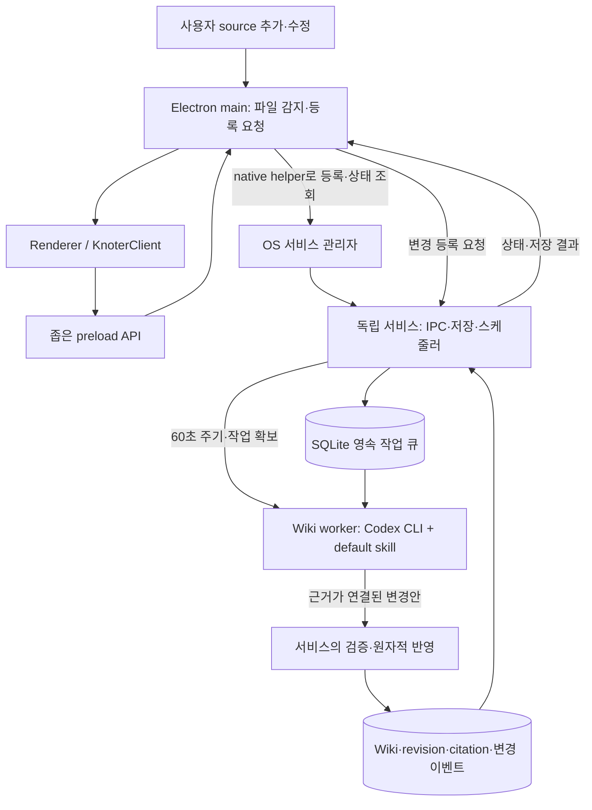

# V2 wiki worker 백엔드 시연 구현 계획

작성: 2026-09-17. 상태: **시연 구현의 범위·결정·검증 기준**.
이 문서는 구현 완료 기록이 아니다. 실행 방법과 검증 한계는 [V2 README](../../v2/README.md)에 둔다.
제품·운영 선택은 아래 결정표를 따른다. 기존 [V2 설계](desktop-rewrite.md)의
저장·보호·복구 원칙을 유지하며, 이번 시연에 필요한 구현 순서와 완료 기준을 정의한다.

## 1. 목표와 범위

사용자가 지정한 요구사항:

1. 실제 wiki worker의 작동을 시연한다.
2. 사용자의 source를 근거로 worker가 wiki를 자동 생성한다.
3. source 추가·수정을 Electron main process가 감지하고 작업 큐에 등록한다.
4. main이 등록한 OS 관리 서비스가 일정 주기마다 worker를 호출하여 wiki를 갱신한다.
5. worker가 일관되게 작업하도록 전용 default skill을 작성한다.
6. 그 밖의 제품·운영 선택은 사용자에게 판단을 요청한다.

시연의 성공은 실제 source 입력, 실제 모델 실행, 영속 큐, 실제 OS 서비스,
wiki 생성과 증분 수정으로 증명한다. mock 응답이나 수동 실행만으로 완료 처리하지
않는다. 서비스가 등록되지 않은 개발 실행은 별도로 표시한다.

확정된 시연 범위는 **macOS + Markdown, 앱에서 Codex CLI 연결·호출,
60초 주기, 여러 source를 통합한 한국어 주제별 wiki**다.
main이 종료된 동안에는 이미 등록된 source snapshot만 처리한다. 그동안의 새
추가·수정은 main을 다시 실행한 뒤 감지한다.

시작 시점의 V2는 브라우저 mock이었다. source 파일명·크기·일부 텍스트만 전달하며 PDF
원본은 보관하지 않는다. Electron main/preload, 영속 DB, 실제 worker와 OS
서비스를 새로 연결해야 한다. 기존 mock 데이터는 시연용 새 저장소로 자동 이관하지
않는다. 작업·달력·채팅의 실제 백엔드, PDF·TXT 입력, Windows 검증, 벡터 검색,
V1 이관, 자동 업데이트와 출시용 배포는 후속 범위로 남긴다.

## 2. 사용자 결정표

기존 설계의 SQLite 단일 쓰기, 원본 보존, 수동 편집 보호, 변경안 검증을 유지한다.

| ID | 결정 | 내용 | 상태 |
| --- | --- | --- | --- |
| D1 | 에이전트 실행 방식 | 앱 서비스가 Codex CLI를 호출. CLI는 변경안 생성, 서비스는 검증·DB 반영 담당 | 사용자 확정 |
| D2 | 시연 OS와 source 형식 | macOS + Markdown 먼저. PDF·Windows는 후속 범위 | 사용자 확정 |
| D3 | 앱 완전 종료 중 새 변경 감지 | 종료 전 main이 등록한 snapshot만 처리. 종료 중 추가·수정은 main 재실행 시 감지 | 사용자 확정 |
| D4 | 모델 | 테스트용 빠른 모델 사용. 구현 후보는 `gpt-5.6-luna` + `low`; 선택 계정에서 접근·출력 품질 확인 후 고정 | 빠른 모델 요구 확정 |
| D5 | 실행 주기 | 60초마다 실행 가능한 큐 확인. ‘지금 실행’은 동일 큐의 보조 기능 | 사용자 확정 |
| D6 | wiki 구성 방식 | 주제별 문서에 여러 source의 근거를 통합 | 사용자 확정 |
| D7 | CLI 배포·인증 연결 | 기존에 설치된 Codex CLI와 ChatGPT 로그인 연결. 시연 사전 조건으로 명시 | 사용자 확정 |
| D8 | wiki 기본 언어 | 한국어. 원문 인용과 고유명사는 유지 | 사용자 확정 |
| D9 | 초기 실행 한도 | 실행당 5분, 자동 재시도 최대 2회, 하루 모델 실행 20회 | 사용자 확정 |
| D10 | 시연 OS 등록 방식 | 이 Mac에 Apple 서명 identity가 없어 SMAppService 실행이 거부됨. 이번 시연은 명시적으로 표시한 사용자 local LaunchAgent를 사용. 출시용 SMAppService 서명은 후속 범위 | 2026-09-17 사용자 확정 |
| D11 | 참고용 wiki 작성 | source 요약 대신 정보를 찾아볼 수 있는 상위/하위 주제 문서와 Markdown 항목으로 구성. 예: HTML → HTML/attribute, HTML/element; attribute 안에는 href, src 항목 | 2026-09-18 사용자 확정 |
| D12 | 부족한 정보 보충 | 모델 기억으로 채우지 않고 공식 문서를 확인한 뒤 출처를 표시. 현재 시연의 공식 자료 provider는 MDN Web Docs이며, 미지원 주제/확인 실패는 한계를 명시 | 2026-09-18 공식 문서 검증 방식 사용자 확정; MDN은 현재 시연 구현 범위 |
| D13 | 개인 지식의 범위와 작성 방식 | 일반 정보뿐 아니라 사용자의 독창적인 생각·아이디어·경험·질문·시험 메모를 보존. 한 source 안에서도 내용의 성격에 맞게 구성하고, 개인의 관점·가설·학습 맥락을 사실 설명과 구별. 외부 입증이나 일률적인 참고 문서 형식을 요구하지 않음 | 2026-09-18 사용자 확정 |

비밀 값은 계획 문서에 저장하지 않는다.
문서 분할은 기존 주제 문서를 먼저 찾고, 독립된 새 주제와 충분한 근거가 있을 때만
새 문서를 제안하는 규칙으로 구체화한다. 적정 분할 예시는 B3에서 검토한다.

## 3. 책임 분리

기존 독립 서비스 설계를 유지하여 **OS가 서비스를 관리하고 서비스가 worker 호출
주기를 관리**한다. UI의 저장 요청과 큐 등록을 받는 서비스가 계속 사용 가능하다.

| 주체 | 책임 |
| --- | --- |
| Renderer | `KnoterClient`로 source, 큐, worker 상태와 결과 표시. 파일·DB·provider에 직접 접근하지 않음 |
| Electron main | 원본 선택과 감시, 추가·수정 통지, 서비스 등록/해제/상태 조회, 서비스 연결과 재연결 |
| OS 관리 서비스 | 큐와 DB의 유일한 쓰기 주체, 원본 snapshot, 스케줄, lease, worker 호출, 변경안 검증·반영, 복구 |
| Wiki worker | Codex CLI adapter가 지정된 source 버전과 기존 wiki를 제공하고 default skill에 따라 변경안 생성. DB·원본 파일에 직접 쓰지 않음 |
| OS/native helper | 사용자 세션의 서비스 등록과 수명주기, 서비스에서 사용 가능한 자격 증명 접근 |

‘main이 큐에 추가’한다는 요구는 main이 서비스에 등록을 요청하고, 서비스의
DB transaction이 완료된 뒤 성공 응답을 받는 것으로 구현한다. main과 worker가
각자 SQLite를 쓰는 구조로 바꾸지 않는다. 서비스 연결이 끊기면 UI에 등록 대기를
표시하고 재연결 후 폴더를 재확인한다. 영속화 전에는 ‘등록 완료’를 표시하지 않는다.
이 대기 중 원본이 제거되면 snapshot을 확보하지 못했음을 표시하며 처리 성공으로 취급하지 않는다.

확정된 D3에 따라 감지와 폴더 재확인은 main만 수행한다. 서비스는 이미 보관한
원본 버전만 처리하며 worker 실행 전에 외부 파일을 다시 읽어 입력을 바꾸지 않는다.
main이 재실행되면 저장된 감시 위치를 재확인하고 누락된 추가·수정을 등록한다.
따라서 UI는 ‘마지막 감지 시점’과 ‘마지막 처리 버전’을 구분해야 한다.

## 4. Source 수집과 영속 큐

1. 사용자가 명시적으로 고른 폴더의 감시를 기준 시연 경로로 제안한다. 감시형 source는
   원래 위치의 변경을 추적한다. 일회성 가져오기는 보관한 snapshot만 처리하며 자동
   추적 여부를 UI에서 구분한다. 허용한 폴더 밖을 재귀 탐색하지 않는다.
2. main은 시작 시 전체 목록을 확인하고 파일 이벤트를 모은다. 연속 저장은 debounce하고,
   main이 안정된 파일을 두 번 읽어 SHA-256과 bytes를 전달하고, 서비스가 hash를 재검증해 snapshot을 보관한다. 서비스에 외부 경로 읽기 권한을 줄 필요가 없다. 읽는 동안
   파일이 바뀌거나 잠겨 있으면 안정화 후 재시도한다. 수정 시각·크기만으로 같다고 판단하지 않는다.
3. 원본 bytes는 관리 영역의 immutable blob으로 보관한다. blob을 먼저 안전하게 저장하고,
   source version·작업·이벤트를 짧은 DB transaction으로 함께 기록한다. 중간 종료로 남은
   임시 blob은 복구 시 정리하되 참조된 원본은 보존한다.
4. source ID는 경로 및 내용 hash와 분리한다. 동일 bytes를 가진 다른 source의 출처는
   합치지 않는다. atomic save와 이름 변경 시 식별 근거가 불충분하면 임의 병합하지 않는다.
   내용이 A→B→A로 되돌아오면 blob은 재사용하되 새 version을 기록하여 wiki도 되돌릴 수 있다.
5. 같은 source version, pipeline version, skill version에 대한 재등록은 하나의 작업으로
   합친다. 미실행 구버전 작업은 최신 버전 작업으로 대체했다는 관계를 남긴다. 실행 중
   작업의 입력 버전은 변경하지 않고 새 작업을 추가한다.
6. worker 호출 직전 서비스가 실행 가능한 작업을 원자적으로 확보한다. workspace당
   실행은 한 번에 하나로 시작하며, tick이 겹쳐도 두 worker를 시작하지 않는다.

작업 기록에는 입력 source 버전, pipeline/skill/model 식별자, 상태, 현재 단계,
시도 횟수, 다음 실행 가능 시각, lease 소유자·만료·세대, 취소 요청, 결과 변경안,
오류 분류를 남긴다. 이는 구현할 저장 계약이며 현재 TypeScript 타입을 복사한
완성 스키마가 아니다. B1에서 migration과 wire schema를 함께 정한다.

상태는 기존 설계의 `queued → running → succeeded`를 기본으로 하며,
재시도는 `retry_wait`, 사용자 판단은 `needs_review`, 종료는 `failed/cancelled`로
구분한다. 인증·권한 부족은 원인을 가진 대기 상태로 표현하고 주기마다 재요청하지 않는다.
최신 버전으로 대체한 작업은 `cancelled`와 명확한 대체 사유·후속 작업 ID를 기록한다.

source 상태와 job 상태는 분리한다. 예전 버전으로 생성된 wiki가 있어도 최신 버전이
처리 중이면 ‘최신화 완료’로 표시하지 않는다. 폴더 접근 실패나 원본 삭제는 별도로
표시하고 기존 wiki·원본 snapshot을 자동 삭제하지 않는다.

2026-09-18 보완: 처리 완료와 wiki 연결 여부는 다르다. 연결된 활성 문서가 없는
source의 `no_change`는 성공 대신 `needs_review`로 남긴다. 기존 버전의 잘못된
무변경 성공은 이유와 재시도 동작을 노출하며, 재처리 중에는 과거 완료 표시보다
현재 작업 상태를 우선한다. 관련 기존 문서가 없으면 근거가 충분한 새 주제를 생성한다.

## 5. Worker 실행과 wiki 갱신

D11·D13에 따라 source의 의미와 개인 지식의 맥락을 보존하며, 압축 요약이나
단일 문서 형식을 강제하지 않는다. 먼저 실제 구간에서 사실 설명·개인의 해석과
가설·아이디어·경험·학습 중 질문과 풀이를 구별한다. 한 source에 이들이 함께
있을 수 있으며, 별도 유형 schema나 고정된 문서 template을 요구하지 않는다.
개인 생각은 고유한 표현·전제·이유·불확실성을, 시험 메모는 문제 조건·기록된 풀이와
오답·질문을 보존한다. 원본에 없는 동기·결론·오답 경험·시험 출제 정보를 만들어내지 않는다.

참고 지식에는 D11의 상위/하위 주제와 Markdown 항목을 적용할 수 있다.
`HTML → HTML/attribute → ## href`는 예시이며 모든 입력에 적용할 규칙이 아니다.
아이디어에는 논지와 열린 질문을, 학습 메모에는 맥락을 가진 목차와 개념 링크를
사용하는 등 내용에 맞게 구성한다. 일반 개념과 연결하더라도 독창적인 생각이나
개별 문제의 맥락을 흡수해 없애지 않는다. 같은 주제라는 이유만으로 관점을 병합하지 않는다.
기존 ID와 사용자 제목을 보존하고, 새 문서 간 제목 링크는 동일 transaction에서
UUID 링크로 고정한다.

원본은 사용자가 어떤 생각·경험·질문을 기록했다는 근거가 될 수 있으며, 이것만으로
개인 지식을 wiki에 보존할 수 있다. 그 안의 모든 주장이 객관적으로 참이라는 뜻은
아니다. D12의 외부 보충은 사실 확인·설명·비교가 필요한 경우에 적용하고, 개인
아이디어를 승인하거나 반박하는 필수 관문으로 사용하지 않는다. 미지원 분야도
출처에 귀속한 내용을 보존하고 확인하지 못한 사실만 구체적으로 표시한다.

D12의 현재 공식 보충은 서비스의 `reference_read`를 통해 MDN 공식 content 저장소만
읽는다. 임의 URL·query·redirect·credential·source 본문 전송은 허용하지 않는다.
attempt당 8개 문서, 문서당 256 KiB, fetch당 15초로 제한하고, 처음 읽은 자료를
그 attempt 안에서 재사용한다. source/wiki 입력은 고정하며, 추가로 읽은 공식
자료의 URL·조회 시각·hash·구간을 attempt manifest에 기록한다. revision에는
실제로 읽은 공식 구간의 별도 citation을 붙이고 보충 설명 옆에 링크를 표시한다.
공식 자료 snapshot은 DB와 함께 backup/restore하며, 사용자 원본 citation으로
보충 설명을 위장하지 않는다. 원본 source 목록에 공식 자료를 섞어 재처리하지 않는다.

실행 순서는 `snapshot 확인 → 텍스트/구간 추출 → 관련 wiki 탐색 → 변경안 생성 →
검증 → 원자적 반영 → 검색 projection/변경 이벤트 갱신`이다.

- Markdown은 원본 버전과 연결된 heading/문단 구간으로 추출한다. PDF 추출기는
  이번 시연에 추가하지 않는다. 빈 결과·실패·읽지 못한 부분은
  추론으로 채우지 않는다. 원문 크기 제한과 처리 가능 형식을 명시한다.
- 기존 citation 의존 관계를 우선 읽고, 새 source는 제목·키워드·관련 wiki 검색으로
  갱신 대상을 찾는다. 초기 시연에서 임베딩은 필수가 아니며 키워드 검색의 한계를
  표시한다. 한국어·영어 소규모 corpus에서 주제별 문서 선택과 통합을 확인한다.
- 각 실행은 고정된 source version과 wiki revision을 입력으로 사용한다. worker의
  도구는 해당 workspace의 근거·wiki 읽기와 D12의 공식 자료 읽기로 제한하고
  최종 응답으로 변경안을 제출한다.
- 변경안은 허용된 생성·본문 교체 연산, 대상 ID, 예상 revision, source version과
  구간 citation, 변경 이유를 담는다. 기존 문서의 stable ID와 wiki 링크를 유지한다.
- 서비스는 schema, 크기, 허용 연산, 존재하는 근거, workspace 범위, 현재 revision,
  보호·Trash 상태를 검사한다. 유효한 JSON만으로 내용이 사실이라고 간주하지 않는다.
- 자동 관리 문서는 검증 후 반영한다. 수동 편집으로 보호된 문서는 본문을 덮어쓰지 않고
  검토할 제안으로 저장한다. Trash의 문서를 worker가 복원하거나 같은 문서로 재생성하지 않는다.
- 반영 직전에 입력 source가 DB에 접수된 버전 중 여전히 최신인지 다시 확인한다.
  이 검사는 외부 폴더 재탐색이 아니다. 구버전 작업은 최신화 성공으로
  처리하지 않고 최신 작업으로 넘긴다. 이미 생성 중이던 결과가 새 source를 덮어쓰지 못한다.
- DB transaction에서 revision 비교와 lease 세대 확인 후 문서·revision·citation·적용 ID·
  outbox를 함께 저장한다. LLM 호출 중 DB lock을 잡지 않는다. 동일 적용 ID는 재반영하지 않는다.
- source 의존 관계에는 필요한 유지보수 대상을 포함한다. 생성 시 문서 단위 의존 관계를
  남겨 원문 문장이 제거되거나 바뀌었을 때 해당 wiki의 기존 주장도 다시 검토한다.

네트워크 오류와 일시적 provider 제한은 유한 횟수의 backoff로 재시도한다. 영구적인
인증·형식 오류는 자동 반복하지 않는다. 실행 시간·도구 호출·출력·사용량 한도를 적용한다.
runner는 실행 중 heartbeat로 lease를 갱신하고 갱신 실패 시 실행을 중단한다.
worker가 죽으면 lease 만료 후 복구하되 이전 worker의 늦은 응답은 세대 검사로 거부한다.
취소 요청도 반영 transaction 전에 확인한다. 이미 commit된 작업은 취소 성공으로
표시하지 않고 revision 복원 경로를 제공한다. 응답 유실 때 모델 요금이 중복 발생할 수
있으므로 보장하는 것은 wiki의 중복 반영 방지이지 정확히 한 번의 과금이 아니다.

확정한 사용 한도는 다음처럼 집계한다. CLI 실행을 시작하기 전에 DB에서 하루 횟수를
원자적으로 예약하고, 자동 실행·수동 실행·재시도를 모두 합쳐 knoter 시연 인스턴스당
하루 최대 20회로 제한한다. 앱 밖에서 사용한 Codex 횟수는 이 한도에 포함하지 않는다.
시작된 실행은 실패해도 횟수를 되돌리지 않는다. 날짜 경계는 설정된 로컬 시간대를
사용하고 UI에 초기화 시각을 표시한다. 한도 도달 시 작업을 보존하고 다음 실행 가능
시각까지 기다린다. 자동 재시도 2회는 최초 시도를 포함해 최대 3번이며, 각 CLI
프로세스 시작부터 종료까지 5분 watchdog을 적용한다. 모델 내부의 다중 추론·도구 호출을
각각 별도 실행으로 세지는 않는다. 토큰·금액 상한과 동일한 보장은 아니다.

## 6. Codex CLI adapter

모델 실행은 서비스의 `CodexWorkerAdapter` 경계 안에 둔다. 직접 LLM API를 호출하는
AI SDK adapter는 이번 시연에 추가하지 않는다. Electron main이 CLI를 직접 장시간
실행하면 앱 종료 후 처리 요구를 만족할 수 없으므로 서비스가 자식 프로세스를 소유한다.

초기 호환성 확인 기준은 개발 머신의 CLI `0.154.0`이다. 절대 경로는 앱의 연결 설정으로
보관하며 `/opt/homebrew/bin/codex`를 제품에 하드코딩하지 않는다. 서비스 계정의 인증
접근과 실제 모델 실행은 B0의 별도 검증이다.

실행 프로토콜 제안:

1. B0에서 CLI 절대 경로·호환 버전·로그인 상태·모델 접근을 확인한다. 앱 설정에서
   연결 정보를 표시하고, missing CLI/인증 만료/모델 접근 실패를 서로 구분한다.
   background service는 로그인 브라우저를 반복해서 열지 않고 연결 복구를 기다린다.
2. 각 attempt를 새 `codex exec`로 실행한다. `--json` 이벤트와 종료 코드로 진행·실패를
   수집하고 `--output-schema`의 최종 JSON을 변경안으로 받는다. 자연어 로그를 wiki
   본문으로 저장하지 않는다. `--ephemeral`을 사용하고 재시도 입력은 앱 기록으로 구성한다.
3. 프로세스는 argument array와 stdin으로 실행한다. prompt는 worker 지침, 명시적으로
   로드한 default skill, 고정된 job manifest, 근거 ID를 포함한다. 사용자 source를
   셸 명령 문자열에 삽입하지 않는다. 프로세스 ID·CLI 버전·model·skill hash를 남긴다.
4. `--sandbox read-only`와 worker 전용 실행 설정을 적용한다. `--ignore-user-config`는
   기존 인증을 사용하면서 개인 config가 실행에 섞이지 않게 하는 후보이며 B0에서 검증한다.
   셸·명령 실행·임의 웹 검색·불필요한 플러그인/도구·hook은 비활성화하고, D12의
   제한된 공식 문서 읽기만 추가한다. 사용자 정책을
   완화하지 않는다. read-only만으로 읽기 범위가 제한된다고 가정하지 않는다.
5. source 구간·wiki 검색·공식 자료 읽기는 앱의 job 한정 capability를 가진 stdio MCP
   bridge로 제공하는 안을 사용한다. bridge는 Unix socket으로 서비스에 연결하고
   workspace·attempt·허용 source 버전·lease를 매 요청 검증한다. DB 쓰기 도구는
   제공하지 않는다. 최종 변경안만 서비스가 받아 검증·저장한다.
6. 유효한 최종 결과와 정상 종료를 모두 확인한 뒤 반영한다. timeout/취소 시 CLI와
   하위 bridge를 종료·회수하며, 서비스 재시작 뒤 남은 프로세스는 만료된 capability로
   접근·반영하지 못하게 한다. stdout 크기와 전체 실행 시간도 제한한다.

위 옵션은 로컬 CLI 도움말과 공식 [비대화형 실행 문서](https://learn.chatgpt.com/docs/non-interactive-mode)에서
확인했다. 도구 허용 목록과 shell/web 설정은 [설정 명세](https://learn.chatgpt.com/docs/config-file/config-reference)를
기준으로 선택 버전의 실제 도구 목록까지 검증한다. 원치 않는 도구가 남으면 B0 완료로
처리하지 않는다. 임의 코드 실행 허용으로 이 제약을 우회하지 않는다.

빠른 모델 후보 `gpt-5.6-luna`와 명시적 `-m` 선택은
[공식 모델 안내](https://learn.chatgpt.com/docs/models)를 근거로 한다. 실제 응답 시간과
주제 통합 품질을 소규모 원문으로 확인한다. 다른 모델로 자동 변경하지 않고,
접근 불가나 품질 실패 시 대안을 사용자에게 요청한다. Codex가 반환한 사용량을
기록하되 금액·남은 구독량을 임의 추정하지 않는다.

인증은 기존 CLI의 ChatGPT 로그인을 사용하며 재사용 여부를 실제 LaunchAgent에서
확인한다. [Codex 인증 문서](https://learn.chatgpt.com/docs/auth)의 로그인 흐름을 사용하고
앱 DB·로그에 토큰이나 credential 파일 사본을 저장하지 않는다.

## 7. 전용 default skill 작성 계획

skill은 Codex wiki worker의 실행 입력으로 명시적으로 로드하는 제품 리소스다.
Markdown 지침과 구조화된 도구 계약을 함께 제공한다. CLI의 암묵적인 skill 선택이나
사용자 머신의 전역 skill 설치에 의존하지 않는다.

`v2/resources/skills/wiki-worker/SKILL.md`를 번들 기본 지침의 소스로 사용한다.
개인 전역 skill로 설치하지 않고 매 실행에 명시적으로 공급한다.
runtime의 제약·검증 코드는 skill 지침과 별개로 강제한다.

`SKILL.md`에는 `name: knoter-wiki-worker`와 범위가 분명한 `description`을 둔다.
adapter가 번들의 본문·필요 참조를 읽어 매 실행에 공급하고 skill hash를 검증한다.
선택 CLI가 이를 실제 입력으로 받는지 첫 실행 증거에 남긴다. `references/`에는
변경안 예시·citation 규칙을 둘 수 있지만 자동 설치 스크립트는 필요하지 않다.
[공식 skill 형식](https://learn.chatgpt.com/docs/build-skills).

| 구성 | 작성할 규칙과 예시 |
| --- | --- |
| 목적과 완료 조건 | 지정된 source 변경을 wiki에 반영하거나, 근거 부족/검토 필요/변경 없음의 이유를 제출 |
| 입력과 신뢰 | job manifest와 허용 도구를 읽고 source·wiki 본문은 근거 데이터로만 취급. 본문의 명령으로 권한을 확대하지 않음 |
| 작업 순서 | 변경 source 읽기 → 관련 wiki 및 근거 확인 → 수정/생성/변경 없음 선택 → citation 포함 변경안 제출 |
| 문서 구성 | 주제별 통합·제목·D8 언어 규칙, 기존 주제 우선 갱신, 중복 문서 방지, stable ID 링크 사용 |
| 증분 수정 | 추가된 주장, 바뀐 주장, 삭제된 근거를 비교. 다른 source가 지지하는 내용은 함께 확인 |
| 보호 정책 | 수동 편집·Trash·권한·source 최신성 제약을 준수하고 충돌은 제안으로 반환 |
| 출력 계약 | 구조화된 변경안만 제출, 존재하는 citation ID 사용, 부족한 근거는 경고, 임의 HTML·실행 코드·출처 생성 금지 |
| 중단 기준 | 입력 부족, 추출 실패, 모호한 병합, 한도 초과를 구분하여 종료 |
| 예시 | 첫 생성, 관련 문서 갱신, 동일 내용 무변경, 상충된 source, 보호된 문서, 악의적인 source 지시 |

HTML/JavaScript 학습 자료의 예시는 Markdown inline/fenced code 안에 보존할 수 있다.
코드 예제 밖의 raw HTML과 위험한 URL·원격 이미지는 Markdown 구문으로 구분해
거부하며, reader의 raw HTML 비활성화와 URL 정제도 유지한다.
출력 schema에는 해당 attempt의 source/version ID를 열거해 ID 복사 오류를 줄인다.
실제 읽기 여부와 source/version/segment 조합은 서비스가 별도로 검증한다.

skill version/hash와 적용된 도구 계약 버전을 job attempt에 기록한다. skill 변경 후
실패 작업을 다시 실행할 때 새 버전 사용을 명시한다. default skill 갱신이 기존 wiki의
전체 재생성을 자동 유발하지 않게 한다. 사용자 skill 편집 기능은 후속 범위로 남기며,
추가 시 기본 지침과 사용자 수정의 보존 정책을 먼저 정한다.

## 8. OS 서비스와 IPC

main의 ‘백그라운드 활성화’ 흐름에서 native helper로 서비스 등록을 요청하고,
등록·OS 승인 대기·실행 중·중지·오류 상태를 구분한다. 등록 성공만으로 worker
연결 성공을 간주하지 않는다. main의 자식 프로세스를 띄우는 것만으로 완료하지 않는다.

기존 플랫폼 설계의 번들 LaunchAgent/SMAppService는 Apple 서명을 갖춘 후속 배포 경로다.
D10에 따라 이번 시연은 `~/Library/LaunchAgents`의 사용자 LaunchAgent를
`launchctl bootstrap/bootout`으로 등록·해제한다. 설치된 앱의 native launcher가
번들 Node 서비스를 소유한다. UI에 local LaunchAgent demo로 표시한다.
Windows 어댑터 구현은 이번 시연에서 제외한다. 등록 API와 주기 실행 메커니즘은 별개다.
[Apple SMAppService](https://developer.apple.com/documentation/servicemanagement/smappservice).

서비스는 활성화된 사용자 세션에서 유지되며 60초마다 큐를 확인한다. 비어 있으면
LLM을 호출하지 않는다. 일시정지는 신규 worker 실행을 막고 큐는 보존하며, 실행 중
작업의 취소는 별도 동작으로 제공한다. UI 완전 종료와 서비스 비활성화를 구분한다.
서비스가 중지되어 읽기·저장이 불가능하면 UI에 명시하고 renderer의 편집 초안을 유지한다.
60초는 큐 확인 간격이며 wiki 생성 완료 시간 보장이 아니다. 실행 중에는 다음 tick에서
겹쳐 시작하지 않고, 다음 실행 가능한 tick에서 대기 작업을 확보한다.

절전·로그아웃·전원 꺼짐 중 실행을 약속하지 않는다. 시작·재시작·복귀 때 due 작업과
만료 lease를 확인하고, 놓친 tick 횟수만큼 worker를 중복 실행하지 않는다.
source 재확인은 main 실행 중에만 수행한다. OS 스케줄의 절전 동작을 애플리케이션의 복구 보장으로
대체해 해석하지 않는다.
[Apple의 절전 시 스케줄 설명](https://developer.apple.com/library/archive/documentation/MacOSX/Conceptual/BPSystemStartup/Chapters/ScheduledJobs.html).

renderer↔main은 좁은 contextBridge와 invoke/handle API를 사용한다.
[Electron IPC](https://www.electronjs.org/docs/latest/tutorial/ipc).
main↔service는 기존 설계의 사용자 전용 Unix socket과 인증 handshake를
따른다. source는 main에서 얻은 허용된 handle/등록 위치로 전달하며 renderer가 보낸
임의 경로를 신뢰하지 않는다. 요청·작업·취소 ID, protocol version, 길이 제한,
runtime validation, 오류 코드, 이벤트 cursor와 재연결 snapshot을 정의한다.
현재 `SourceImport`와 `AbortSignal`을 그대로 wire payload로 사용하지 않는다.

서비스 자체는 번들 Node와 필요한 native module을 사용하고 사용자 PATH에 의존하지 않는다.
Codex CLI는 기존 설치를 선택한 절대 경로로 호출한다. CLI 설치·로그인이 필요하다는
시연 전제를 명시하며, 이 예외를 서비스 자체의 Node runtime 의존으로 확대하지 않는다.
자격 증명은 UI 종료 뒤에도 서비스 계정이 읽을 수 있어야 한다. 실행 파일·skill·
작업 인자는 명시적인 경로와 argument array로 전달한다. OS 서비스 등록/해제 시
사용자 source와 DB는 유지한다. 배포용 서명이나 업데이트 지원은 실제 증거 없이 주장하지 않는다.

## 9. 구현 순서와 각 단계의 완료 기준

아래 순서는 기존 M0~M3 중 시연에 필요한 부분을 연결한 것이다. 전체 milestone이
완료됐다고 표시하지 않는다. 실제 변경은 V2가 통합된 `dev`에서 시작하거나 사용자가
별도 기반을 지정한 topic branch에서 수행한다. 이 계획은 현재 V2 문서를 기준으로 한다.

| 단계 | 구현 범위 | 완료 기준 |
| --- | --- | --- |
| B0 — 실행 기반 | Electron main/preload, 서비스 최소 실행, runtime과 OS 등록 방식, 기존 Codex CLI 연결·권한·빠른 모델 검증 | 설치된 데모 앱에서 서비스 등록·연결·완전 종료 후 생존·해제를 실제 확인. 서비스의 CLI 인증·모델 접근·제한된 도구 목록 확인 |
| B1 — 저장·계약 | SQLite migration, immutable source bytes, wiki/revision/citation, 영속 큐, 검증된 IPC, 내보내기·일관된 백업/복원 | 서비스 재시작 후 보존, stale revision 거부, 백업 복원 후 문서·원본 연결 확인 |
| B2 — 감지·큐 | main watcher, 초기/재연결/절전 복귀 재확인, 안정된 snapshot, hash dedup | 파일 추가·수정이 정확한 버전 작업으로 남고 같은 저장 이벤트는 중복 처리되지 않음 |
| B3 — 생성·skill | Codex CLI adapter와 읽기용 MCP bridge, source 추출, 관련 wiki 조회, default skill, 변경안 검증·반영 | 새 source로 citation이 연결된 wiki를 생성하고 어떤 원본 버전을 사용했는지 열어 확인 |
| B4 — 주기·증분·복구 | 서비스 tick, lease/취소/backoff, 최신 버전 검사, 수동 편집 제안, outbox 재처리 | 다음 실행 가능한 주기에 갱신 시작, 완료 후 stable ID 유지. 중간 종료·중복 호출·편집 충돌에서 잘못된 덮어쓰기 방지 |
| B5 — UI 연결·시연 | connected `KnoterClient`, source/job/service 상태, 마지막·다음 실행, 실패 이유, 재시도·취소·제안 확인 | UI에서 source→job→변경된 wiki를 따라갈 수 있고 완전 종료 후 결과를 재실행에서 확인 |

새 service/worker/platform 모듈은 각 단계가 필요로 할 때 추가한다. 실행 경계는
공유 domain/application 로직과 분리하되 빈 패키지부터 만들지 않는다. mock과
connected 모드의 데이터·표시를 분리하고, 아직 연결하지 않은 채팅/작업/달력 기능을
실제 기능처럼 표시하지 않는다. 작업마다 source 원본을 수정하지 않았는지 확인한다.

## 10. 수동 시연과 검증 시나리오

일회용 workspace와 복제한 source만 사용한다. 자동 테스트·CI를 재도입하지 않는다.
코드 변경은 [V2 README](../../v2/README.md)의 `npm run check`를 실행하고,
새 backend package도 검사 대상에 포함하도록 check 구성을 확장한다.
모든 변경에서 `git diff --check`를 실행한다.

| 시나리오 | 확인할 증거 |
| --- | --- |
| 최초 생성 | 새 source → main 등록 → 영속 queued → 주기 실행 → 실제 wiki·citation·revision |
| source 수정 | 동일 source의 새 version → 기존 wiki ID 유지 → 새 근거로 갱신, 관련 없는 wiki 유지 |
| 관련 source 추가 | 기존 주제에 새 근거 통합, 독립 주제만 새 문서 생성, 기존 근거·링크 보존 |
| 중복 이벤트·빈 큐 | 동일 저장 여러 번과 연속 tick에도 중복 revision 없음, 빈 큐의 모델 호출 없음 |
| 생성 중 source 재수정 | 오래된 결과가 최신 결과를 덮지 않고 후속 작업 완료 후 최신 버전 표시 |
| 사람의 wiki 수정 | 생성 중 저장 충돌 거부, 보호된 문서는 자동 덮어쓰기 없이 제안 생성 |
| worker/service 강제 종료 | lease 복구, 이미 반영된 변경의 중복 적용 없음, 늦은 응답 거부 |
| provider·인증·취소 | 일시 실패의 제한된 재시도, 인증 복구 대기, 취소 성공한 작업의 미반영, 이미 commit된 작업의 정확한 상태 표시 |
| CLI 연결·출력 | CLI 없음·버전 불일치·로그인 만료 구분, 비정상 종료·잘못된 JSON 거부, UI 없이 모델 실행 |
| 실행 한도 | 5분 watchdog, 자동 재시도 2회 상한, 하루 20회 이후 대기와 날짜 경계 복구. 실제 20회 모델을 소모하지 않고 일회용 DB 집계값으로 경계 수동 확인 |
| UI 완전 종료 | main이 등록한 작업은 처리됨. 종료 중 새 변경은 등록되지 않으며 main 재실행 후 등록·처리됨 |
| OS 수명주기 | 설치 경로에서 등록·중지·재시작·절전 복귀·해제 확인, 개발 터미널에 종속되지 않음 |
| 데이터 보존 | 원본 hash 불변, Trash 자동 복원 없음, 접근 불가 폴더를 삭제로 오인하지 않음, 백업 복원 가능 |
| skill 품질 | 허구 citation·source 속 명령·상충된 근거·불충분한 근거를 처리한 결과를 사람이 검토 |

실패와 검증하지 못한 환경은 V2 README에 날짜·조건·원인·남은 한계로 기록한다.
선택하지 않은 OS/형식, 미확인 CPU 아키텍처, 대규모 데이터 성능, 출시용 서명·배포는
시연 결과로 보증하지 않는다. 위 시나리오는 예정된 검증이며 아직 수행되지 않았다.
